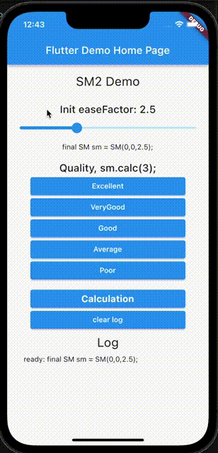

# A spaced repetition algorithm(SM-2) implemented with dart.

## This package was created by forking [sm2](https://github.com/thyagoluciano/sm2).

Suggestions for improvements in implementation and API design are always welcome!

**Please feel free to [open the issue](https://github.com/ronnieeeeee/supermemo/issues/new).**


#### And I am currently working on developing supermemo with flutter_hooks.

## [**Demo**](https://sm2demo-281a2.firebaseapp.com/#/)

<div align="center">

</div>

## **Getting Started**

You just need to add `supermemo` as a dependency in your `pubspec.yaml` .


```yaml
dependencies:
  supermemo: ^2.0.0
```

## **Usage**


```dart
import 'package:supermemo/supermemo.dart';

final int quality = 0;
final int initRepetitions = 0;
final int initInterval = 0;
final double initEaseFactor = 2.5;
final sm = SM(initRepetitions, initInterval, initEaseFactor);
final SM sm2 = sm.calc(quality);
```

This SM object is reusable.
It may good usecase "state management".

```dart
final SM sm2 = sm.calc(quality);
sm2.calc(quality2).calc(quality3);

//I designed the SM object to be used from some kind of state management system.

state = useState(sm);
state.value.calc(quality);
```

# Links

* [Spaced repetition on Wikipedia](https://en.wikipedia.org/wiki/Spaced_repetition)
* [Official algorithm description](http://www.supermemo.com/english/ol/sm2.htm)
* [Official implementation of SM-2 algorithm in SuperMemo 2](http://www.supermemo.com/english/ol/sm2source.htm)
* http://www.supermemo.com
* http://www.supermemo.eu

# The algorithm requires four inputs

The algorithm requires four inputs: `quality`, `repetitions`, `previous ease factor`, and `previous interval`. The last three inputs are taken from the output of a previous call to SM-2. (On the first call, default values are used.)

## Quality

An integer from 0-5 indicating how easily the information was remembered today. This could correspond to a button such as "Difficult" or "Very Easy."

The official algorithm description explains the meaning of each number:

	5 - perfect response
	4 - correct response after a hesitation
	3 - correct response recalled with serious difficulty
	2 - incorrect response; where the correct one seemed easy to recall
	1 - incorrect response; the correct one remembered
	0 - complete blackout.

## Repetitions (integer)

The number of times the information has been reviewed prior to this review. `repetitions` should equal zero for the first review. 

SM-2 uses this value to define specific intervals for the first and second reviews. SM-2 will also reset this value to zero when `quality` is less than 3.

## ease factor (float)

A floating point number (≥ 1.3) generated by the last iteration of the SM-2 algorithm. `ease factor` should equal 2.5 for the first review. 

The ease factor is used to determine the number of days to wait before reviewing again. Each call to SM-2 adjusts this number up or down based on `quality`.

## interval (integer)

Generated by the last iteration of the SM-2 algorithm. Indicates the number of days to wait between reviews. 

This interval is used when calculating the new interval. `interval` should equal zero for the first review.

# Outputs

The algorithm returns three outputs: `interval`, `repetitions`, and `ease factor`. All three values should be saved and passed to the next call to SM-2 as inputs.

## Interval (integer)

An integer number indicating the number of days to wait before the next review.

## Repetitions (integer)

The number of times the information has been reviewed as of this review. 

This value is maintained between calls to the algorithm and used for calculating `interval`. The number increments after each successful review. SM-2 will reset `repetitions` to zero if `quality` is less than 3.

## Ease factor

A floating point number (≥ 1.3) which is adjusted up or down based on how easily the information was remembered. 

This value is maintained between calls to the algorithm and is used for calculating `interval`.

# Steps

If `quality` is greater than or equal to 3, indicating a correct response:

1. If `repetitions` is 0 (first review), set `interval` to 1 day.
2. If `repetitions` is 1 (second review), set `interval` to 6 days.
3. If `repetitions` is greater than 1 (subsequent reviews), set `interval` to `previous interval * previous ease factor`. (See note about recursion below.)
4. Round `interval` up to the next whole number.
5. Increment `repetitions` by 1.
6. Set `ease factor` to `previous ease factor + (0.1 - (5 - quality) * (0.08 + (5 - quality ) * 0.02))`. (See formula description below.) 

If `quality` is less than 3, indicating an incorrect response:

1. Set `repetitions` to 0.
2. Set `interval` to 1.
3. Set `ease factor` to `previous ease factor` (no change).

If `ease factor` is less than 1.3:

1. Set `ease factor` to 1.3.

Return `interval`, `repetitions` and `ease factor`.

# Ease factor formula

After the first two reviews, `ease factor` is adjusted using this formula:

`previous ease factor + (0.1 - (5 - quality) * (0.08 + (5 - quality) * 0.02))`

The magic numbers come from the official algorithm description.

This increases `ease factor` when `quality` is 5, makes no change when `quality` is 4, and decreases `ease factor` by varying amounts when `quality` is lower than 4. The lower `quality` is, the more `ease factor` is decreased.